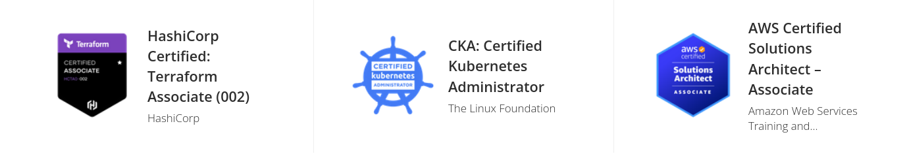
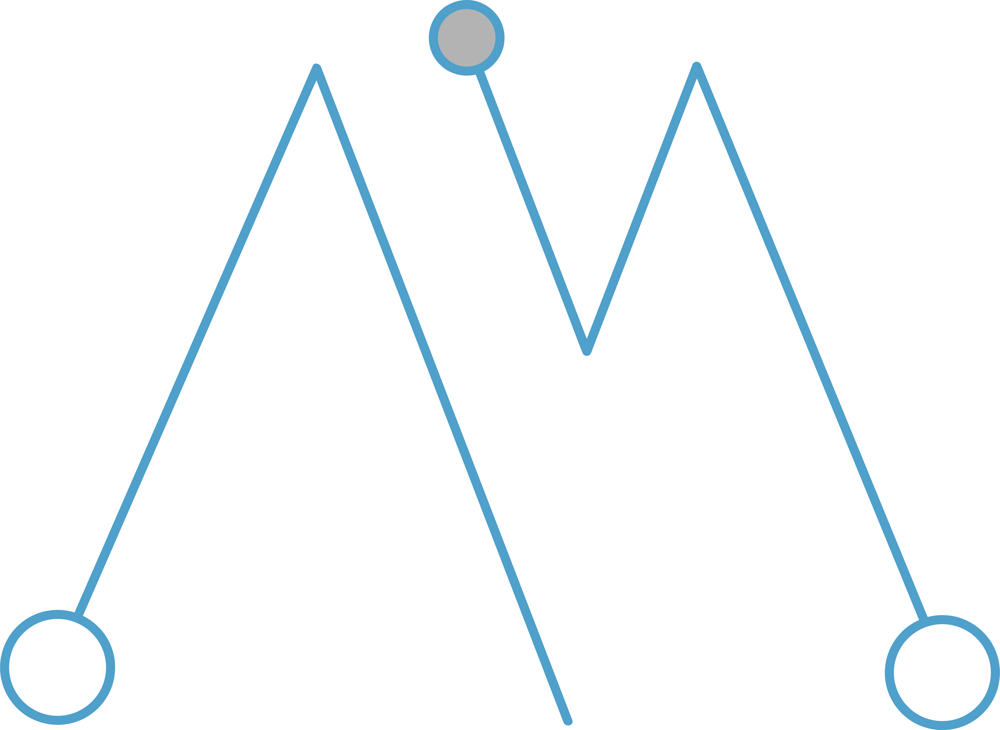

### Qualification Summary

*   Cloud Engineer specialized in AWS/GCP and Kubernetes.

*   Operations and Project Work, Team Player.

*   Spanish C2, English C1, German B2, French A1.

### Employment

#### Senior DevOps at nodeguardians.io - May 2022 - Dec 2022

> GCP and Kubernetes with Docker and Terraform. Kube-Prometheus.

#### Senior Cloud SRE at CAPSiDE/NTT - Feb 2019 - May 2022

> AWS, Terraform & Cloudformation. Specialized in Kubernetes and EKS (eksctl, traefik, prometheus, etc...)

#### Application Delivery Platforms - Web Hosting Member for Boehringer Ingelheim (Ambit) - May 2016 - Feb 2019

> Apache, Tomcat, Jboss, IIS, Automation with Puppet and Powershell. Follow the sun Incident Resolution and Project Work (Set up new environments and Migrations) Starting with Openshift, Jenkins and container related workflow.

#### Subject Matter Expert Microsoft Applications (CSC –Zurich Insurance) - March 2016

> Worked on the Microsoft Windows Applications SME team on several projects: data center migration, server refresh and set-up of new applications; worked onsite with the client and collaborated with third parties. My role was mainly Project Management with a technical side aswell. Learned a lot about ITIL Change Management and ORR documents, planning, implementing, meeting and making things happen.

#### Continuity & Improvement Service Team Member (CSC – Zurich Insurance) May 2015 – March 2016

> Pioneer on this job role, was in charge of incident and problem resolution for 1000+ application servers in all stages, several business units and countries, resolved a big amount of incidents and problem records and created a guide on the new job before moving on to SME.

#### Technical Integration Team Member (CSC – Zurich Insurance) September 2013 – May 2015

> Supported a big application portfolio and learned the basics of web server administration (run & maintain, troubleshooting, uptime, on call), where operative tasks, documentation, incident resolution and release deployment were the daily basis.

### Education

*   University of Oviedo, English Philology (2005-2009) and Computer Science (2009-2013),

*   Christian-Albrechts-Universität zu Kiel (Germany), ERASMUS-Program: Informatics (2012-2013)

### Certifications

*   CKA (Certified Kubernetes Administrator) [verify](https://www.credly.com/badges/50b60cfa-0661-4560-919a-0f7408e45e92/linked_in)
*   AWS Architecting Associate [verify](https://www.credly.com/badges/c21f3c9f-f4d0-46d0-86ff-c458a601784d/linked_in)
*   Red Hat Command Line skills (RH 190)
*   ITIL foundations v3

### Background Skills (previous to cloud work)

*   Server Administration
    *   Windows (2003, 2008, 2008 R2, 2012, 2012 R2, 2016 PowerShell 2.0, 3.0 and 4.0).
    *   UNIX (Red Hat 5, 6 & 7, Debian based distros, Solaris, AIX).
*   Web (IIS 6, 7.5, 8.5 & 10 Tomcat 5, 6 & 7, Apache 2.2 & 2.4, JBoss 6.3 & 6.4, WebLogic).
*   Devops (Puppet, PowerShell, Automation, XML, YAML).
*   Basic understanding and knowledge of Programming Languages (Java mainly but bits of Prolog and Haskell)
*   Basic understanding and experience with Web Languages (Javascript, .Net, ASP)
*   Basic SQL experience (PostGress, SQL Server, ORACLE).
*   Containers and Workflow (Openshift, Jenkins, Nexus, Git).
*   Ticketing & monitoring (ServiceNow, Remedy, TIVOLI, VMWare Service Manager),
*   Prepare & present Information (MS Visio, MS Office, MindMaps, PhotoShop, GIMP, Gephi).
*   Project management (GTD, MS Project, ClearQuest).
*   Stress management techniques, team orientated, good task and relationship balance.
*   Analytical skills, organized and methodical, minimalist approach.
*   Other: Driving License and own car & motorbike, experience in several sports including climbing and basketball (team work, risk management), swimming (concentration and improvement) and cycling (endurance).

